# Awesome Hebrew Fonts


A curated, point-in-time (April 2026) list of great Hebrew fonts available via [Google Fonts](https://fonts.google.com/?subset=hebrew).

Maintained by [Daniel Rosehill](https://danielrosehill.com). Opinions are my own — these are fonts I actually use or appreciate.

> Author/designer credits below are best-effort and may simplify multi-designer projects (especially Hebrew script extensions of Latin originals). Each font's Google Fonts page is canonical.

## Quick Start

```bash
# Interactive terminal menu
./install.sh

# Or non-interactively:
./install.sh --all                       # all curated fonts in this repo
./install.sh --all-hebrew                # every Google Font with a Hebrew subset
./install.sh --category daily stylistic  # one or more categories
./install.sh --font heebo alef           # one or more font ids
./install.sh --list                      # show the curated list
./install.sh --dry-run --all             # preview without downloading

# Graphical front-end (uses zenity or kdialog)
./gui.sh

# Live preview of every font in your browser
xdg-open samples.html
```

The data lives in `fonts.json`. The installer reads from there, downloads TTFs (Hebrew + Latin subsets) from the [google-webfonts-helper](https://gwfh.mranftl.com) API into `~/.local/share/fonts/google/<family>/`, and refreshes the font cache.

Dependencies: `bash`, `curl`, `unzip`, `jq`. The GUI additionally uses `zenity` or `kdialog`.

---

## Daily Drivers

Solid, neutral workhorses for body copy, UI, and documents.

### Open Sans
*Steve Matteson*

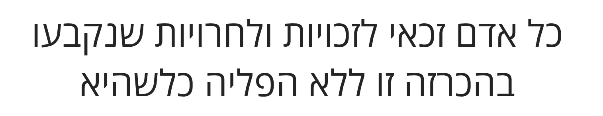

[](https://fonts.google.com/specimen/Open+Sans?script=Hebr)

---

### Google Sans
*Google*

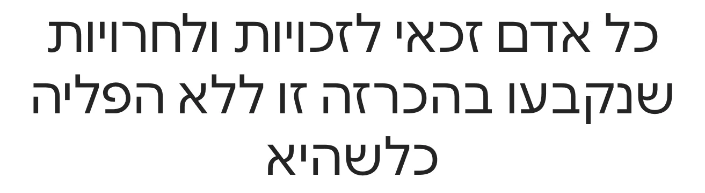

[](https://fonts.google.com/specimen/Google+Sans?script=Hebr)

---

### Arimo
*Steve Matteson*

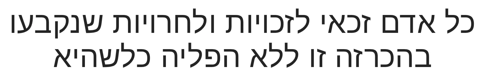

[](https://fonts.google.com/specimen/Arimo?script=Hebr)

---

## Stylistic

A bit more personality — for headlines, marketing, friendly UIs.

### Heebo
*Oded Ezer (based on Christian Robertson's Roboto)*

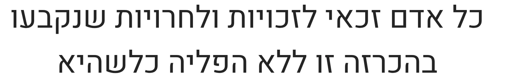

[](https://fonts.google.com/specimen/Heebo?script=Hebr)

---

### M PLUS Rounded 1c
*Coji Morishita (M+ Fonts Project)*

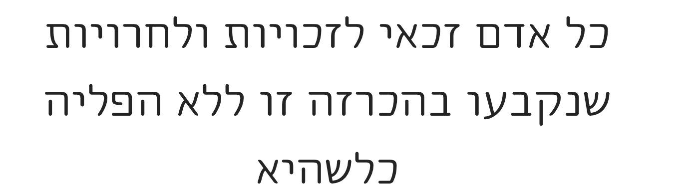

[](https://fonts.google.com/specimen/M+PLUS+Rounded+1c?script=Hebr)

---

### Fredoka
*Milena Brandão (Hebrew extension by Hafontia)*

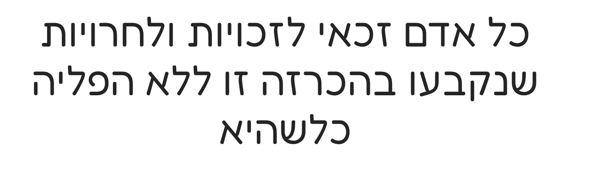

[](https://fonts.google.com/specimen/Fredoka?script=Hebr)

---

### Suez One
*HaTypo*

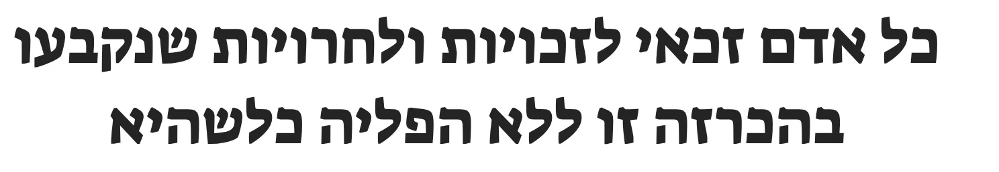

[](https://fonts.google.com/specimen/Suez+One?script=Hebr)

---

## Formal / Liturgical

Serifs and classical faces suitable for prayer books, formal documents, long-form Hebrew/English bilingual text.

### Frank Ruhl Libre
*Yanek Iontef, Michal Sahar (after Raphael Frank's Frank-Ruehl, 1908)*

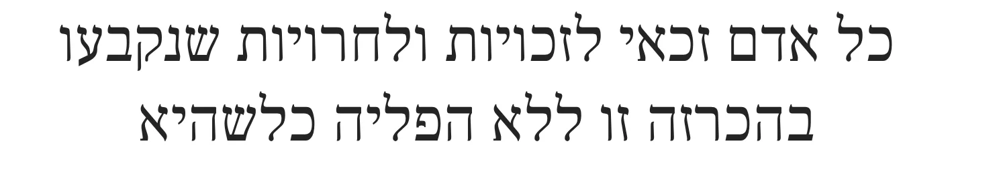

[](https://fonts.google.com/specimen/Frank+Ruhl+Libre?script=Hebr)

---

### Tinos
*Steve Matteson*

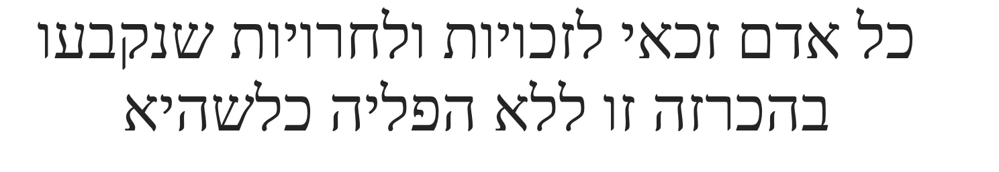

[](https://fonts.google.com/specimen/Tinos?script=Hebr)

---

### Cardo
*David J. Perry*

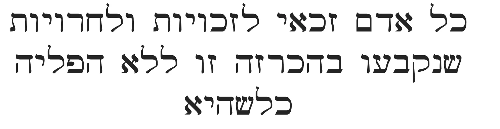

[](https://fonts.google.com/specimen/Cardo?script=Hebr)

---

## Cursive / Handwriting

### Gveret Levin
*AlefAlefAlef Type Foundry*

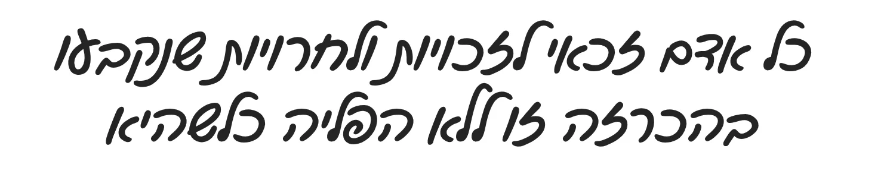

[](https://fonts.google.com/specimen/Gveret+Levin?script=Hebr)

---

### Solitreo
*Juan Bruce*

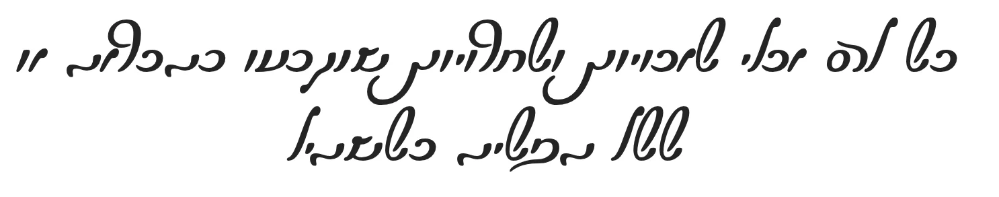

[](https://fonts.google.com/specimen/Solitreo?script=Hebr)

---

### Playpen Sans Hebrew
*Laura Meseguer, TypeTogether*

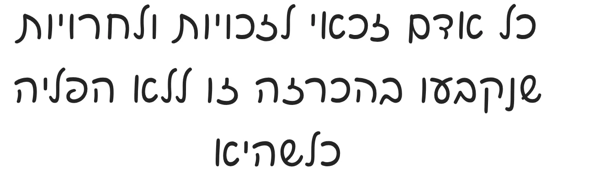

[](https://fonts.google.com/specimen/Playpen+Sans+Hebrew?script=Hebr)

---

## Easy to Read

High legibility, generous proportions — good for accessibility-conscious work.

### Alef
*Mushon Zer-Aviv, HaGilda*

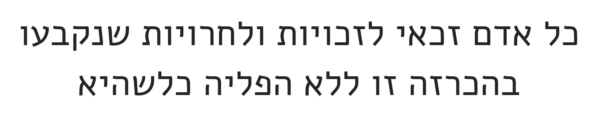

[](https://fonts.google.com/specimen/Alef?script=Hebr)

---

### Secular One
*HaTypo*

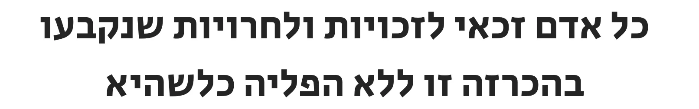

[](https://fonts.google.com/specimen/Secular+One?script=Hebr)

---

### Bellefair
*Daniel Grumer*

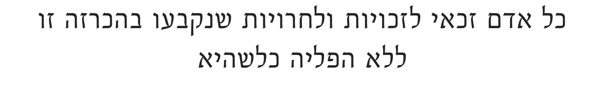

[](https://fonts.google.com/specimen/Bellefair?script=Hebr)

---

## Creative & Effects

Display-only — posters, social, branding moments.

### Rubik Gemstones
*Natalia Raices (Rubik series by Philipp Hubert & Sebastian Fischer; Hebrew by Meir Sadan)*

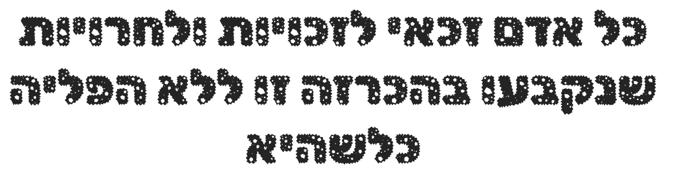

[](https://fonts.google.com/specimen/Rubik+Gemstones?script=Hebr)

---

### Rubik Wet Paint
*Natalia Raices*

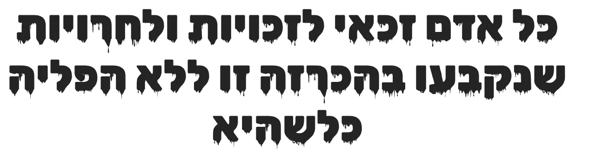

[](https://fonts.google.com/specimen/Rubik+Wet+Paint?script=Hebr)

---

### Rubik Dirt
*Natalia Raices*

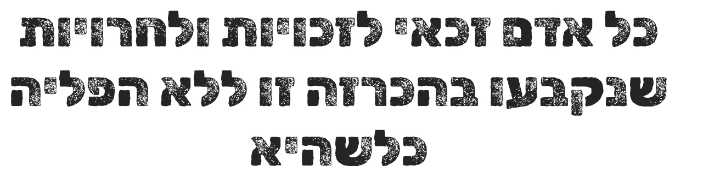

[](https://fonts.google.com/specimen/Rubik+Dirt?script=Hebr)

---

### Rubik Glitch
*Natalia Raices*


[](https://fonts.google.com/specimen/Rubik+Glitch?script=Hebr)

---

### Handjet
*Rosetta Type Foundry (David Březina et al.)*

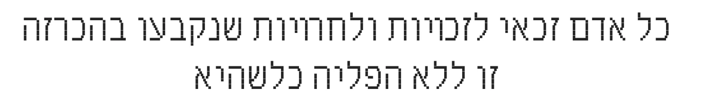

[](https://fonts.google.com/specimen/Handjet?script=Hebr)

---

### Rubik Iso
*Natalia Raices*

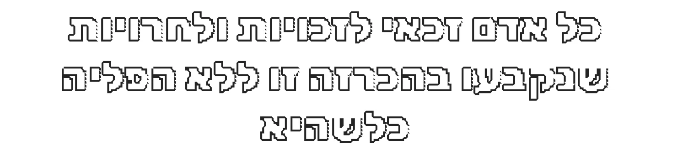

[](https://fonts.google.com/specimen/Rubik+Iso?script=Hebr)

---

### Rubik Moonrocks
*Natalia Raices*

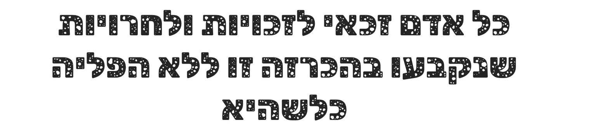

[](https://fonts.google.com/specimen/Rubik+Moonrocks?script=Hebr)

---

## Stencil

### Rubik Doodle Shadow
*Natalia Raices*

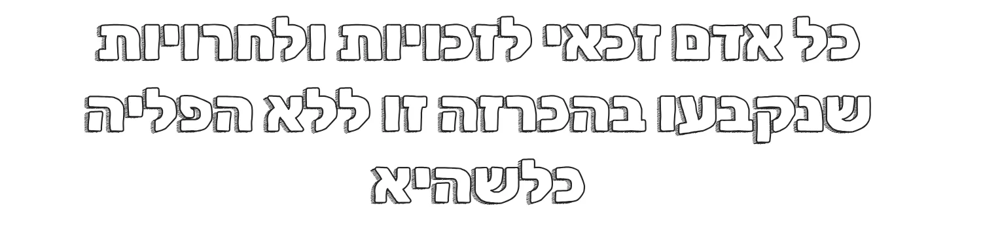

[](https://fonts.google.com/specimen/Rubik+Doodle+Shadow?script=Hebr)

---

## Serif

### Noto Serif Hebrew
*Google / Monotype (Noto project)*

[](https://fonts.google.com/specimen/Noto+Serif+Hebrew?script=Hebr)

---

### Libertinus Serif
*Khaled Hosny (based on Philipp H. Poll's Linux Libertine)*

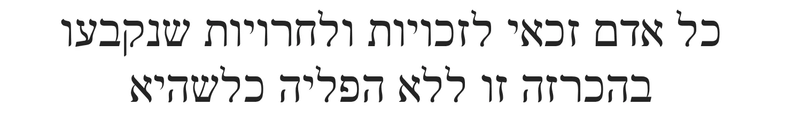

[](https://fonts.google.com/specimen/Libertinus+Serif?script=Hebr)

---

## Nice (general purpose, slightly characterful)

### Miriam Libre
*Michal Sahar (after Henri Friedlaender's Miriam)*

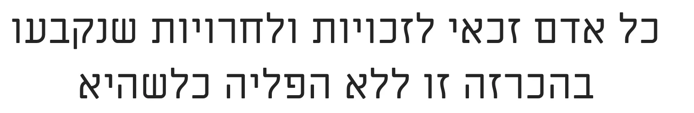

[](https://fonts.google.com/specimen/Miriam+Libre?script=Hebr)

---

### David Libre
*Yoram Gnat (after Ismar David's David)*

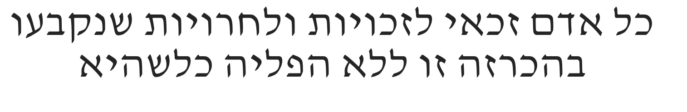

[](https://fonts.google.com/specimen/David+Libre?script=Hebr)

---

## Code / Monospace

### Cascadia Code
*Microsoft (Aaron Bell et al.; Hebrew by Liron Lavi Turkenich)*

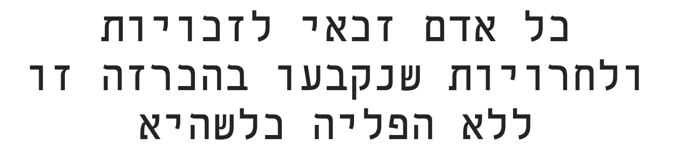

[](https://fonts.google.com/specimen/Cascadia+Code?script=Hebr)

---

## Rashi Script

### Noto Rashi Hebrew
*Google / Monotype (Noto project)*

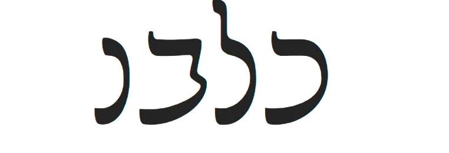

[](https://fonts.google.com/specimen/Noto+Rashi+Hebrew?script=Hebr)

---

## Live Samples

For an in-browser preview rendered via the Google Fonts CDN (no install required), open `samples.html`.

## Beyond Google Fonts — Other Resources

### Free Hebrew font collections

- [FreeFonts.co.il](https://freefonts.co.il/)
- [HebrewFont.net](https://www.hebrewfont.net/)
- [Alef Alef Alef](https://alefalefalef.co.il)
- [HebrewFonts.net](https://hebrewfonts.net/)
- [Open Siddur — Fonts](https://opensiddur.org/help/fonts/) — liturgical-grade open-licensed Hebrew fonts
- [FontMeme — Hebrew Fonts Collection](https://fontmeme.com/fonts/hebrew-fonts-collection/)
- [Adobe Hebrew (Adobe Fonts)](https://fonts.adobe.com/fonts/adobe-hebrew) — included with Creative Cloud
- [Otzar Fonts](https://fonts.otzar.io/) — fonts curated for Jewish/Torah typesetting

### Paid collections / foundries

- [FontBit](https://fontbit.co.il/)
- [Fontsim](https://www.fontsim.com/)
- [Fonts Addict — Hebrew](https://www.fontsaddict.com/font/search/hebrew)
- [Lia Fonts](https://liafonts.com/)

### Paleo Hebrew

- [BiblePlaces — Paleo Hebrew Fonts](https://www.bibleplaces.com/paleo_hebrew_fonts/) — ancient/biblical script

## Open Source Hebrew Fonts on GitHub

Individual font sources and Hebrew-typography projects worth knowing about. These aren't (all) on Google Fonts, so the installer doesn't fetch them automatically — clone and install manually if you need them.

### Fonts

- [OdedEzer/heebo](https://github.com/OdedEzer/heebo) — upstream source for Heebo
- [opensiddur/fonts](https://github.com/opensiddur/fonts) — liturgical/Open Siddur font collection
- [AlefAlefAlef/gveret-levin](https://github.com/AlefAlefAlef/gveret-levin) — Gveret Levin handwriting
- [googlefonts/mekorot](https://github.com/googlefonts/mekorot) — Mekorot, designed for layered Hebrew texts
- [gsshab/OpenSansHebrew](https://github.com/gsshab/OpenSansHebrew) — Open Sans Hebrew variant
- [hafontia-zz/Amatica-sc](https://github.com/hafontia-zz/Amatica-sc) — Amatica SC
- [ibleaman/Keter-YG](https://github.com/ibleaman/Keter-YG) — Keter-YG (Yiddish/Hebrew)
- [arielagor/jetbrains-mono-hebrew](https://github.com/arielagor/jetbrains-mono-hebrew) — JetBrains Mono with Hebrew glyphs

### Biblical

- [bdenckla/Taamey_D](https://github.com/bdenckla/Taamey_D) — Taamey D, Tanakh-cantillation typesetting

### Paleo Hebrew

- [edenberger/Robo-PaleoHeb](https://github.com/edenberger/Robo-PaleoHeb) — Robo Paleo-Hebrew

### Resources / collections

- [Culmus/hebrew-fonts](https://github.com/Culmus/hebrew-fonts) — Culmus project, classic free Hebrew fonts

### Utilities

- [UberStorm/Image-To-Hebrew-Font-Generator](https://github.com/UberStorm/Image-To-Hebrew-Font-Generator)
- [RafaelKipershlak/hebrew-letters-gen](https://github.com/RafaelKipershlak/hebrew-letters-gen)

### RTL utilities

- [voidksa/RTL-Flow](https://github.com/voidksa/RTL-Flow)
- [noambrand/kivun-terminal-wsl](https://github.com/noambrand/kivun-terminal-wsl) — RTL terminal helper for WSL

## License

The font list, README, and installer are released under CC0. The fonts themselves are licensed by their respective authors (mostly OFL or Apache 2.0) — see each font's Google Fonts page.
